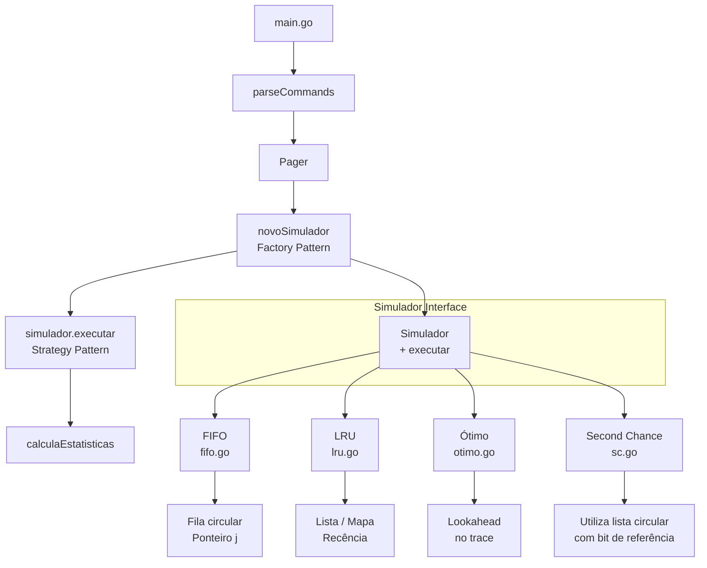

# Simulador de Algoritmos de Substituição de Páginas

Este programa simula diferentes algoritmos de substituição de páginas utilizados em sistemas operacionais para gerenciamento de memória virtual.

##  Índice

- [Como Executar](#como-executar)
- [Formato do Arquivo de Trace](#formato-do-arquivo-de-trace)
- [Saída do Programa](#saída-do-programa)
- [Arquitetura da Aplicação](#arquitetura-da-aplicação)

## Como Executar

```bash
go run . --algo <ALGORITMO> --frames <N> --trace <ARQUIVO> [--verbose]
```

### Parâmetros Obrigatórios

| Flag | Descrição | Exemplo |
|------|-----------|---------|
| `--algo` | Nome do algoritmo de substituição a ser utilizado | `--algo fifo` |
| `--frames` | Número de frames (quadros) disponíveis na memória | `--frames 4` |
| `--trace` | Arquivo contendo a sequência de referências de páginas (uma por linha) | `--trace entrada.trace` |

### Parâmetros Opcionais

| Flag | Descrição |
|------|-----------|
| `--verbose` | Exibe informações detalhadas durante a execução *(planejado)* |

### Exemplos de Uso

```bash
# Executar com algoritmo FIFO e 3 frames
go run . --algo fifo --frames 3 --trace referencias.trace

# Executar com algoritmo LRU e 4 frames
go run . --algo lru --frames 4 --trace entrada.trace

# Executar com algoritmo Ótimo e 5 frames
go run . --algo otimo --frames 5 --trace trace.trace
```

##  Formato do Arquivo de Trace

O arquivo de trace deve conter uma sequência de números inteiros, um por linha, representando os números das páginas referenciadas:

```trace
1
2
3
4
1
2
5
1
2
3
4
5
```

**Observações:**
- Cada linha deve conter apenas um número inteiro
- Linhas inválidas (texto, vazias) são ignoradas com log de erro
- Não há limite para o tamanho do arquivo

## Saída do Programa

O programa exibe as seguintes estatísticas após a simulação:

```
[1 2 3 4 1 2 5 1 2 3 4 5]
Algoritmo: FIFO
Frames: 3
Referências: 12
Faltas de página: 9
Taxa de faltas: 75.00%
Evicções: 6
Conjunto residente final:
frame_ids:  0  1  2
page_ids:   3  4  5
Tempo de execução: 123.456µs
```

### Métricas Explicadas

| Métrica | Descrição |
|---------|-----------|
| **Algoritmo** | Nome do algoritmo executado |
| **Frames** | Número de frames usados na simulação |
| **Referências** | Total de acessos à memória processados |
| **Faltas de página** | Número de vezes que uma página não estava na memória |
| **Taxa de faltas** | Percentual de acessos que resultaram em page fault |
| **Evicções** | Número de páginas removidas da memória |
| **Conjunto residente final** | Estado final dos frames de memória |
| **Tempo de execução** | Duração da simulação |

##  Arquitetura da Aplicação

### Visão Geral





**Desenvolvido para a disciplina de Sistemas Operacionais - UFC**
